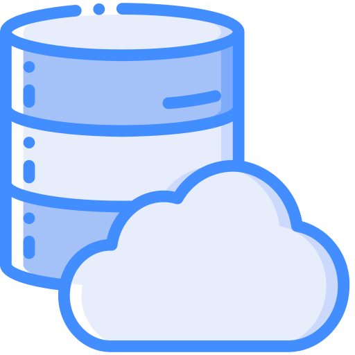

# SQLGenerator 

### Description

Service for generating DML commands across multiple banks using the C# language.
This project is currently developed using .NET CORE 6.

Releases are distributed through NuGet packages available in the ./Generator/Releases folder.

### Current SGBD supported

- PostgreSQL
- SQLServer

### Adjustments and improvements

The project is still under development and the next updates will focus on the following tasks:

- [ ] Improvements in command generation
- [ ] Exit code identification
- [ ] Availability of commands through API
- [ ] Expand support for Oracle and MySQL

## 💻 Requirements

- Visual Studio or Visual Studio Code
- .NET CORE 6

## 📝 Permission

 Copyright (c) 2022 SQLGenerator - Matheus Poletto
 MIT License

 Permission is hereby granted, free of charge, to any person obtaining a copy
 of this software and associated documentation files (the "Software"), to deal
 in the Software without restriction, including without limitation the rights
 to use, copy, modify, merge, publish, distribute, sublicense, and/or sell
 copies of the Software, and to permit persons to whom the Software is
 furnished to do so, subject to the following conditions:

 The above copyright notice and this permission notice shall be included in
 all copies or substantial portions of the Software.

 THE SOFTWARE IS PROVIDED "AS IS", WITHOUT WARRANTY OF ANY KIND, EXPRESS OR
 IMPLIED, INCLUDING BUT NOT LIMITED TO THE WARRANTIES OF MERCHANTABILITY,
 FITNESS FOR A PARTICULAR PURPOSE AND NONINFRINGEMENT. IN NO EVENT SHALL THE
 AUTHORS OR COPYRIGHT HOLDERS BE LIABLE FOR ANY CLAIM, DAMAGES OR OTHER
 LIABILITY, WHETHER IN AN ACTION OF CONTRACT, TORT OR OTHERWISE, ARISING FROM,
 OUT OF OR IN CONNECTION WITH THE SOFTWARE OR THE USE OR OTHER DEALINGS IN
 THE SOFTWARE.
